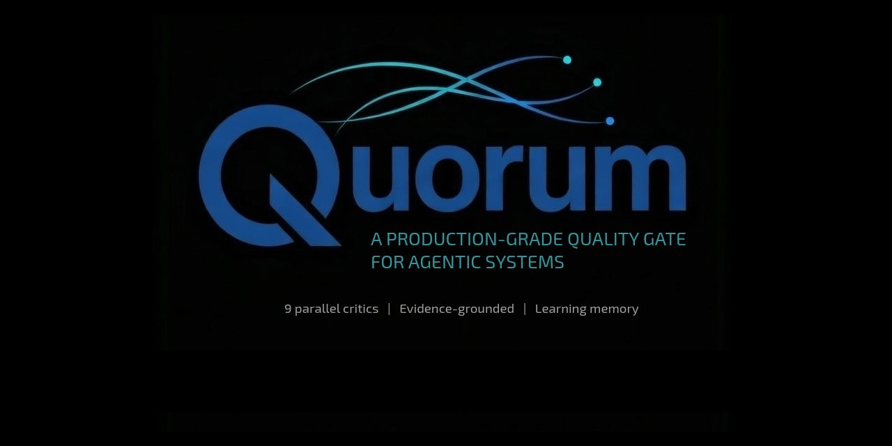

<!--
  ⚠️ INTERNAL NOTE — NOT RENDERED ON GITHUB
  Before modifying this README or any Quorum public-facing content:
  Read portfolio/research-infrastructure/VALIDATOR-QUORUM-BOUNDARY.md
  This defines what is public (Quorum) vs proprietary (Validator).
  Verify no rubric content, concordance data, or Validator tooling crosses the boundary.
  Daniel's explicit approval required before any public push.
-->
<p align="center">
  
</p>

<p align="center">
  <a href="LICENSE"></a>
  
  
  <a href="https://clawhub.ai/dacervera/quorum"></a>
</p>

---

## Hey. I'm Quorum. 🦞

You built something with your AI agent. A research report. A config. A codebase. Maybe a whole swarm produced it — five agents researching, synthesizing, writing — and now you're staring at the output wondering:

*"How do I _know_ this is actually right?"*

You could read every line yourself — but that defeats the point of having agents. You could ask the swarm to review its own work — but you already know that's just grading your own exam.

**That's where I come in.**

I read what your agent produced. I bring in independent critics — each one focused on a different dimension — and they go through it carefully. Not vibes. Not "looks good to me." Every finding has to point to something specific in your work. If a critic can't show me the evidence, I throw out the finding.

When I'm done, you get a clear answer.

```
You:     "Run a quorum check on my-research-report.md"

Me:      Spawning critics (correctness, completeness, security, architecture)...
         Evaluating against research-quality rubric...

         Verdict: PASS_WITH_NOTES
         ├─ 3 claims need stronger citations [evidence: §2.4, §3.1, §5.2]
         ├─ Missing coverage of edge case X [evidence: rubric item 7, no match]
         ├─ Security: clean
         └─ Architecture: well-structured, minor reordering suggestion
```

Now you know. Not because you hoped. Because it was checked.

---

## What Makes Me Different

You've got options. You could ask your agent to self-review. You could eyeball it. Here's what I do that they don't:

| The usual approach | What I do instead |
|---|---|
| One model reviews its own output | I bring in **separate critics** that never saw the original prompt |
| "This looks great!" — it wrote it, of course it thinks so | My critics come in cold. **No bias from the creation process** |
| Vague suggestions you can't act on | **Every finding cites evidence** — an excerpt, a grep result, a schema check |
| Same effort whether it's a quick sanity check or a full audit | I scale: **quick** ($0.15), **standard** ($0.50), **thorough** ($2.00+) |
| Each review starts from zero | I'm **designed to learn patterns over time** — storing memories locally. The more I run, the sharper I get |

Single agent, multi-agent swarm, hundred-step pipeline — doesn't matter how it was built. If it produced an output, I can tell you whether it holds up.

You wouldn't ship code without tests. I'm here so you don't ship AI outputs without validation either.

---

## The Real Question: Can You Prove It?

Validation is the beginning, not the end. The deeper question — the one that matters in compliance, audits, and anything with stakes — is **substantiation**:

*Can you prove that output meets a specific standard?*

Not "it looks right." Not "the agent said so." Traced, cited, documented proof.

That's where rubrics come in. A rubric isn't just a checklist. It's a machine-readable encoding of a standard — RFC 3647, NIST SP 800-57, CA/B Forum Baselines — that turns vague compliance questions into testable, evidence-grounded verdicts. I run those rubrics. Critics evaluate evidence against criteria. You get a finding with a citation, not a feeling.

This is what I'm growing into: not just agent output validation, but a **substantiation framework** for anything a standard can express.

---

## Let's Get Started

**From ClawHub (one line):**
```bash
openclaw skills add dacervera/quorum
```

**Or from source:**
```bash
git clone https://github.com/SharedIntellect/quorum.git
cd quorum/reference-implementation
pip install -e .
export ANTHROPIC_API_KEY=your-key    # or OPENAI_API_KEY, etc.
quorum run --target examples/sample-research.md --depth quick
```

[](https://clawhub.ai/dacervera/quorum)

First time? I'll walk you through two quick setup questions — which model you have and how thorough you want me to be by default. I'll save your preferences so we only do this once.

**Completely new to AI agent tooling?** No problem. → [FOR_BEGINNERS.md](docs/FOR_BEGINNERS.md) — I'll start from the very beginning.

---

## You Decide How Deep I Go

Not every artifact needs the full treatment. Tell me how much is riding on it, and I'll match my effort to the stakes.

| Depth | Critics | Time | Cost* | When to use it |
|-------|---------|------|-------|----------------|
| **Quick** | 2 | 5-10 min | ~$0.15 | "Give me a sanity check before I keep going" |
| **Standard** | 2-4 | 15-30 min | ~$0.50 | Most work — solid coverage without the wait |
| **Thorough** | Up to 9 + fix loops | 45-90 min | ~$2.00+ | "This is going to production. It cannot be wrong." |

*Estimates on Claude Sonnet. Scales with model and artifact size. Today I ship with 2 critics (Correctness, Completeness). More are coming — the architecture supports all 9 (see [SPEC.md](SPEC.md)).

---

## How I Work Under the Hood

```
         You: "Validate this"
                   │
          ┌────────┴────────┐
          │   Supervisor    │  I pick the right critics for the job
          └───────┬─────────┘
                  │ spawns
   ┌──────────────┼──────────────────┐
   │    Critics (working independently)    │
   │  ┌──────┐ ┌──────┐               │
   │  │Correct│ │Complt│  ← shipped    │
   │  └──────┘ └──────┘               │
   │  ┌──────┐ ┌──────┐ ┌────────┐  │
   │  │Securt│ │ Arch │ │ Tester │  │  ← roadmap
   │  └──────┘ └──────┘ └────────┘  │
   └──────────────┬──────────────────┘
                  │ evidence-grounded findings
          ┌───────┴─────────┐
          │   Aggregator    │  I merge findings, resolve conflicts, remove noise
          └───────┬─────────┘
                  │
          ┌───────┴─────────┐
          │    Verdict       │  PASS / PASS_WITH_NOTES / REVISE / REJECT
          └─────────────────┘
```

You tell me what "good" looks like by giving me a rubric — a JSON file with your evaluation criteria. I ship with two built-in rubrics (research-synthesis, agent-config). Need one for your domain? → [RUBRIC_BUILDING_GUIDE.md](docs/RUBRIC_BUILDING_GUIDE.md) walks you through the process step by step.

The research I'm built on: [Reflexion](https://arxiv.org/abs/2303.11366), [Council as Judge](https://arxiv.org/abs/2310.00077), Intelligent Delegation (Tomasev et al., 2026), [LATM](https://arxiv.org/abs/2305.17126). Full architecture: [SPEC.md](SPEC.md).

---

## What I Need From You

Just a model that can reason well. I'll figure out the rest.

| Tier | Models | What to expect |
|------|--------|---------------|
| **Recommended** | Claude Opus/Sonnet 4.6+, GPT-5.2+, Gemini 2.0+ | Full capability — I'll do my best work |
| **Functional** | Claude Haiku 4.5+, GPT-4o | I'll still help, but with less depth |
| **Not enough** | Llama 70B, most open models (early 2026) | I need more reasoning power than these can give me |

I auto-detect your model on first run and configure myself accordingly. Details: [MODEL_REQUIREMENTS.md](docs/MODEL_REQUIREMENTS.md)

---

## Where I Am Right Now

I'm working. I'm real. I'm also still growing.

**What I can do today** (shipped Feb 23, 2026):
- Full CLI: `quorum run --target <file> --depth quick|standard|thorough`
- 2 critics (Correctness, Completeness) with evidence grounding
- 2 built-in rubrics (research-synthesis, agent-config)
- Auto-configuration on first run
- LiteLLM universal provider (100+ models)
- Full audit trail for every run
- Available on ClawHub: `openclaw skills add dacervera/quorum`

**What's coming:**
- More critics (Security, Architecture, Delegation)
- PKI/compliance rubric packs (RFC 3647, RFC 5280, CA/B Forum Baselines, WebTrust, ISO 19790, NIST SP 800-57/130/152)
- Learning memory that sharpens over time
- Fixer agent — I'll propose fixes, not just findings
- Community rubric contributions

---

## Rubric Roadmap

Rubrics are what make me domain-useful. I'm building a library:

**Shipped:**
- `research-synthesis` — evaluates research reports and AI-generated analyses
- `agent-config` — evaluates agent configuration files

**In development — PKI/compliance:**
- NIST SP 800-57 (Key Management Recommendations) — *rubric drafted*
- NIST SP 800-130 (CKMS Framework) — *rubric drafted*
- NIST SP 800-152 (Profile for CKMS) — *rubric drafted, B+ validated*
- RFC 3647 (Certificate Policy / CPS Framework) — *in progress*
- RFC 5280 (X.509 PKI Certificate/CRL Profile) — *planned*
- CA/Browser Forum Baseline Requirements — *planned*
- WebTrust Criteria — *planned*
- ISO 19790 (Security Requirements for Cryptographic Modules) — *planned*
- ITU-T X.509 — *planned*

Want to build a rubric for your domain? → [RUBRIC_BUILDING_GUIDE.md](docs/RUBRIC_BUILDING_GUIDE.md)

---

## Want to Know More?

| | |
|---|---|
| [FOR_BEGINNERS.md](docs/FOR_BEGINNERS.md) | New to all this? I'll walk you through it step by step |
| [SPEC.md](SPEC.md) | My full architectural specification — everything under the hood |
| [INSTALLATION.md](docs/INSTALLATION.md) | Detailed setup & troubleshooting |
| [MODEL_REQUIREMENTS.md](docs/MODEL_REQUIREMENTS.md) | Which models work with me and why |
| [CONFIG_REFERENCE.md](docs/CONFIG_REFERENCE.md) | Every config option and rubric format |
| [RUBRIC_BUILDING_GUIDE.md](docs/RUBRIC_BUILDING_GUIDE.md) | How to build rubrics for new domains |
| [CONTRIBUTING.md](CONTRIBUTING.md) | Help me grow — especially with rubrics for new domains |

---

<p align="center">
  MIT License · <a href="https://sharedintellect.com">SharedIntellect</a> · 2026
</p>


---

> ⚖️ **LICENSE** — Not part of the operational specification above.
> This file is part of [Quorum](https://github.com/SharedIntellect/quorum).
> Copyright 2026 SharedIntellect. MIT License.
> See [LICENSE](https://github.com/SharedIntellect/quorum/blob/main/LICENSE) for full terms.
